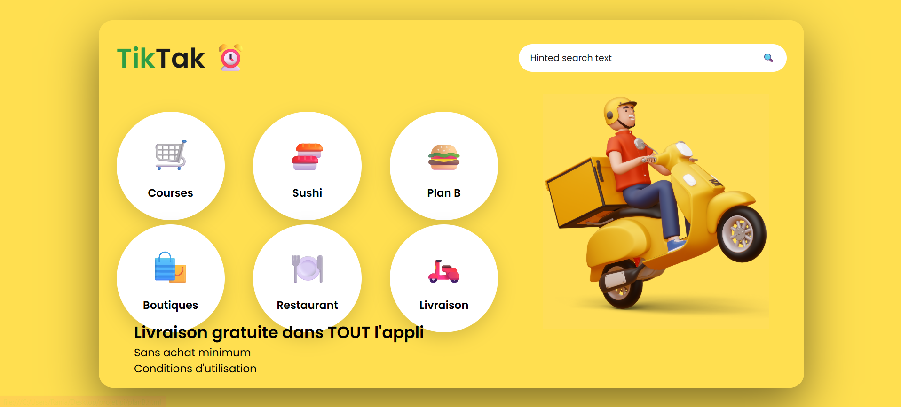
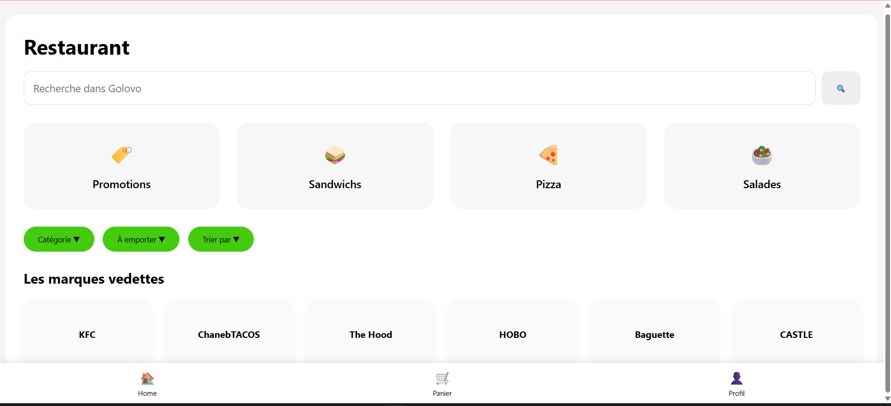

# Application Web de Livraison

## Description

Application web de livraison développée dans le cadre d'un projet académique.
Elle permet aux utilisateurs de consulter différents services, de parcourir
les restaurants, magasins et supermarchés, et de gérer leurs commandes.

## Technologies utilisées

- HTML5
- CSS3
- JavaScript

## Fonctionnalités

- Page d'accueil
- Inscription et profil utilisateur
- Consultation des restaurants
- Consultation des magasins
- Consultation des supermarchés
- Interface utilisateur responsive

## Auteur

**Hamza Ben Romdhane**

## Aperçu

### Page d'accueil

### Restaurants

### planB

### Profil

